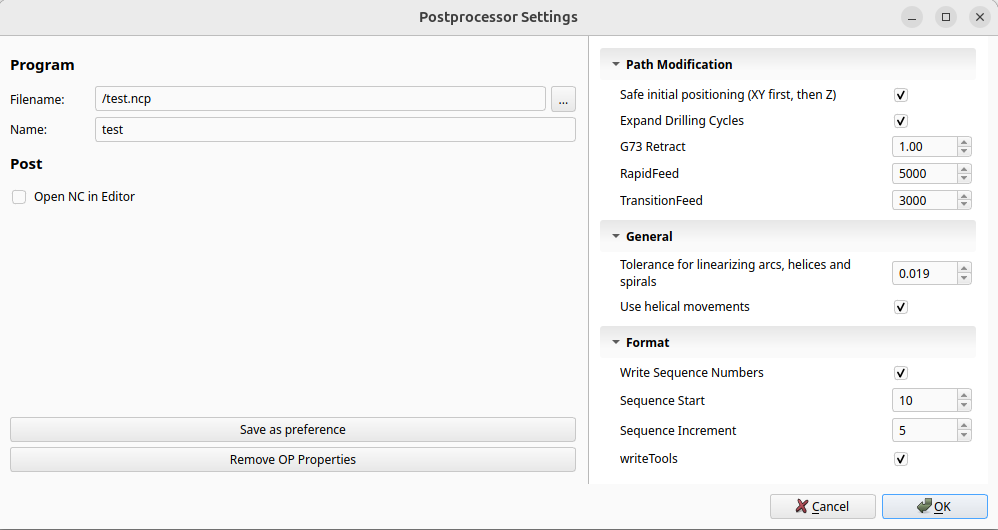
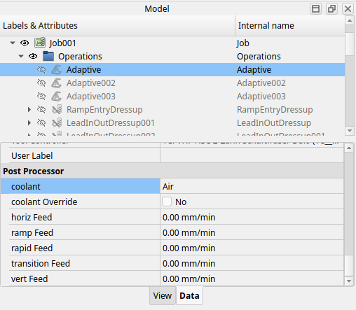

# FreeCAD PostExt  
**Extensions for FreeCAD CAM Postprocessors**

## Overview

PostExt is a small extension layer built on top of FreeCAD’s class-based `PostProcessor` API.

Its purpose is to encapsulate recurring postprocessor responsibilities, improve configurability and transparency for users, and provide a clearer structure for developing modern CAM postprocessors—without replacing FreeCAD’s existing architecture.

PostExt is fully opt-in and intended as a supporting library for postprocessors that require more explicit, post-driven control.

---

## Motivation

While developing custom CAM postprocessors, several recurring challenges become apparent:

- Postprocessor configuration is commonly done via command-line style arguments, which are hard to discover and difficult for users to understand.
- Customization at operation level (feeds, coolant behavior, motion handling) is limited or not explicitly modeled.
- Similar tasks like expand drilling cycles are repeatedly implemented in different postprocessors.

At the same time, FreeCAD’s source code explicitly recommends that new postprocessors derive from the class-based `PostProcessor` API, while most available documentation still focuses on legacy postprocessor scripts.

PostExt was created to explore how these gaps can be addressed while staying compatible with the existing CAM infrastructure.

## Quick Start

PostExt is intended for developers writing class-based FreeCAD CAM postprocessors. It provides entry points for motion and job events, for example:

- beforeExport / afterExport
- beforeOperation / afterOperation
- onRapid / onLinear / onCircular
- onDwell / onToolChange / onSpindleSpeed / onCoolant

This concept of defining entry points for key post events is common
in CAM postprocessor frameworks. PostExt implements it fully in
a class-based, object-oriented manner.

A minimal postprocessor based on PostExt looks like this:

```python
from PostExt.post_properties import Property
from PostExt.output_formatting import Format, Coolant
from PostExt.base import Plane, BasePostExt

class MyPost(BaseExtPostProcessor):

  def __init__(self, job):
    super().__init__(
        #params for FreeCAD's PostProcessor
        job=job,
        tooltip="My Machine Postprocessor",
        units="Metric",

        #available coolants for this machine
        coolants=["Air", "Mist", "Air+Mist"], 
        file_ending="nc",
    )

    self.properties = self.createProperties(
      useHelics = Property(
        title = "Use helical movements",
        value = True
      ),
      gotoSafePosBeforeOp = Property(
        type = "Bool",
        group = "Safety",
        title = "Safe Position Before Operation",
        scope = ["post","op"],
        hint = (
          "Some useful hint\n"
        ),
        value = True,
        op_value = False,
      ),
    )

    #define output formats
    self.xOutput = self.createOutputVariable(format=Format(prefix="X",scale=1e3))
    self.yOutput = self.createOutputVariable(format=Format(prefix="Y",scale=1e3))
    self.zOutput = self.createOutputVariable(format=Format(prefix="Z",scale=1e3))
    self.feedFormat = Format((prefix="F",decimals=2))
    self.coolantOutput = self.createCoolantManager(
      # translate coolantes from operation dialog
      Coolant(id="Mist", on=["SETBIT A2.2"],off=["RESBIT A2.2"]),
      Coolant(id="Flood", on=["COOLANT ON"],off=["COOLANT OFF"]),

      #translate additional coolants defined by the post and when using coolant override
      Coolant(id="Air", on=["COOLANT ON"],off=["COOLANT OFF"]),
      Coolant(id="Air+Mist", on=["SESBIT A2.2","COOLANT ON"],off=["RESBIT A2.2","COOLANT OFF"]),
    )

  def beforeExport(self):
    #preamble ...

  def afterExport(self):
    #postamble ...

  def beforeOperation(self, operation):
    self.writeSeperation()
    self.writeComment(operation.getLabel())
    self.writeSeperation()
    gotoSafe = self.properties.gotoSafePosBeforeOp.value or self.curr_operation.properties.gotoSafePosBeforeOp.value
    if gotoSafe:
      #output cmd to go to a safe position

  def afterOperation(self, operation):
    self.writeBlocks(self.coolantOutput.disableCoolant())

  def onLinear(self, _x, _y, _z _feed):
    x = self.xOutput.format(_x)
    y = self.xOutput.format(_y)
    z = self.xOutput.format(_z)
    if x or y or z:
      self.writeBlock("G1",self.feedFormat.format(_feed),x,y,z)

  def onRapid(self, _x, _y, _z _feed=None):
    x = self.xOutput.format(_x)
    y = self.xOutput.format(_y)
    z = self.xOutput.format(_z)
    if x or y or z:
      self.writeBlock("G0",x,y,z)
  
  def onCoolant(self, _coolant):
    self.writeBlocks(self.coolantOutput.setCoolant(_coolant))

  def onCircular(self, clockwise, i, j, k, x, y, z, feed):
    if self.isSpiral() or (self.isHelix() and self.properties.useHelics.value == False):
      self.linearize()
      return

    #output circular cmds...
    #...

  def onSpindelSpeed(self, _speed, _clockwise):
    # enable spindle and set speed...
```

### Postprocessor Properties

The following dialog shows post-level properties defined by a PostExt-based
postprocessor:



### Operation-Level Properties

Properties scoped to operations appear directly on each CAM operation:



## Postprocessor Entry Methods

PostExt postprocessors implement the same entry methods as FreeCAD’s
class-based `PostProcessor`.

Commonly used entry points include:

- `beforeExport` / `afterExport`
- `beforeOperation` / `afterOperation`
- `onRapid(_x,_y,_z, _feed=None)`
- `onLinear(_x,_y,_z, _feed)`
- `onCircular(self, clockwise, i, j, k, x, y, z, feed)`
- `onDwell(self, _seconds)`
- `onToolChange(self, _tool)`
- `onSpindleSpeed(self, _speed, _clockwise)`
- `onCoolant(self, _coolant_)`
-	`onDwell(self, _seconds)`


---

## Core Concepts

### BaseExtPostProcessor

At the center of PostExt is a base class that derives from FreeCAD’s `PostProcessor`.

It provides shared infrastructure while leaving all machine- and controller-specific behavior to concrete postprocessors.


### Declarative Property System

PostExt introduces a declarative property system intended as a replacement for traditional command-line post arguments.

Properties are:

- defined by the postprocessor
- automatically rendered in a dedicated configuration dialog
- explicitly scoped to their area of effect

Each property can apply to:

- the postprocessor as a whole
- individual operations
- or both

This makes it possible to express machine-specific behavior (feeds, coolant handling, motion options, formatting) in a structured and user-visible way.

The goal is not to add more configuration, but to make existing configuration explicit, understandable, and context-aware.

---

### Geometry and Motion Handling at Post Level

Certain responsibilities are inherently post-specific and difficult to express at CAM level alone.

PostExt centralizes such logic, including:

- expansion of drilling cycles
- optional linearization of circular, helical, and spiral movements
- tolerance handling controlled by the postprocessor

This allows each postprocessor to decide how motion should be translated for the target machine.

---

### Output Formatting and Statistics

PostExt provides helpers for structured output generation:

- formatted output variables for axes and parameters
- centralized tracking of minimum and maximum values
- collection of warnings during postprocessing
- generation of statistics (e.g. machining time, travel ranges)

This keeps formatting logic out of motion handlers and makes post output easier to maintain.

---

## Addressing Common CAM Limitations (Opt-In)

PostExt includes optional mechanisms that allow postprocessors to handle commonly discussed CAM limitations where required by the target machine, for example:

- controlling rapid positioning order (e.g. avoiding Z-first positioning)
- replacing certain rapid moves below safe Z with feed moves
- defining feed rates per operation rather than per tool
- allowing postprocessors to define arbitrary coolant modes beyond fixed presets

All such behavior is explicitly enabled and configured by the postprocessor.

---

## Relationship to FreeCAD’s Refactored Postprocessors

FreeCAD’s refactored postprocessors primarily describe post behavior through configuration values that are interpreted by the framework.

PostExt takes a different approach:  
it focuses on explicit, post-driven control over motion handling, output formatting, and machine-specific behavior implemented directly in the postprocessor.

This is not intended as a replacement for FreeCAD’s existing approach.  
PostExt explores an alternative structure that may be better suited for machines with non-standard requirements or highly post-specific behavior.

---

## Reference Implementations

PostExt is used by the following postprocessors:

- [**ISEL CNC Postprocessor**](https://github.com/mLamneck/FreeCAD-IselNcp.git)  

The ISEL postprocessor serves as a real-world reference implementation demonstrating how PostExt concepts can be applied in practice.

---

## Status and Intent

PostExt is currently experimental.

It is intended as:

- an exploration of structured, class-based postprocessors
- a documentation aid for the recommended `PostProcessor`-based approach
- a shared foundation for post-level functionality

It is **not** intended to replace existing postprocessors or workflows.

Feedback and discussion are welcome.
